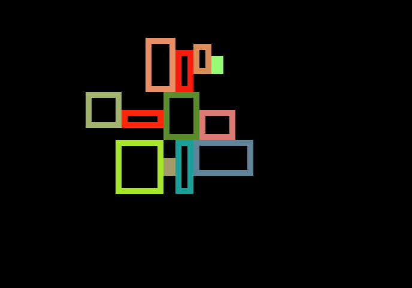

# ProcJam2019

A collection of experiments in procedural design for ProcJam 2019. Click each heading to go to the code

## [Spaceship layout generation](room-layout-packing)

I created a series of algorithms to pack rectangles together into interesting shapes.

I then started grouping rectangles (rooms) together by their function, and adding doors between them

The next step involved creating a tileset system and corresponding tileset test-bed to find missing tiles. The tilesets were quickly split into 3 sets of tiles to fluidly mark room boundaries.
To complement the new interior aesthetic, ornamental "greebles" such as antennae and lights were added to the outside perimeter of the spaceships.

Finally, I added props to the insides of the rooms. Pieces of furniture such as crates or beds are chosen based on the room's purpose.

## [Cellular Automata](cellular)
_Implementation of conway's game of life_

_A smoothing Cellular Automata to turn noise into cave-like structures_

## [Force-based layout](room-layout-spring-sim)
_An early attempt to generate spaceship layouts by using springs and force simulations_

